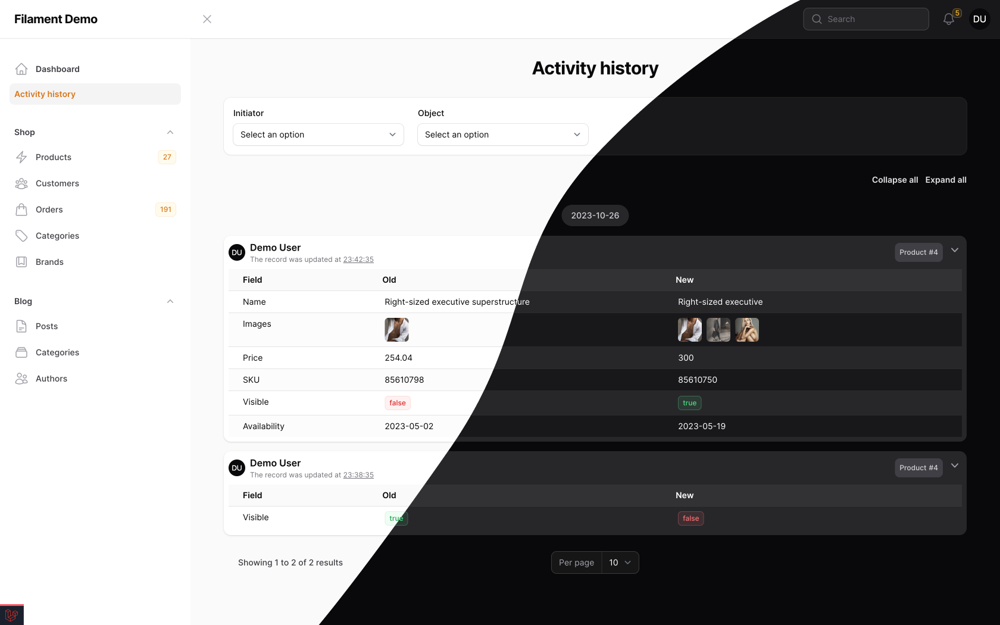
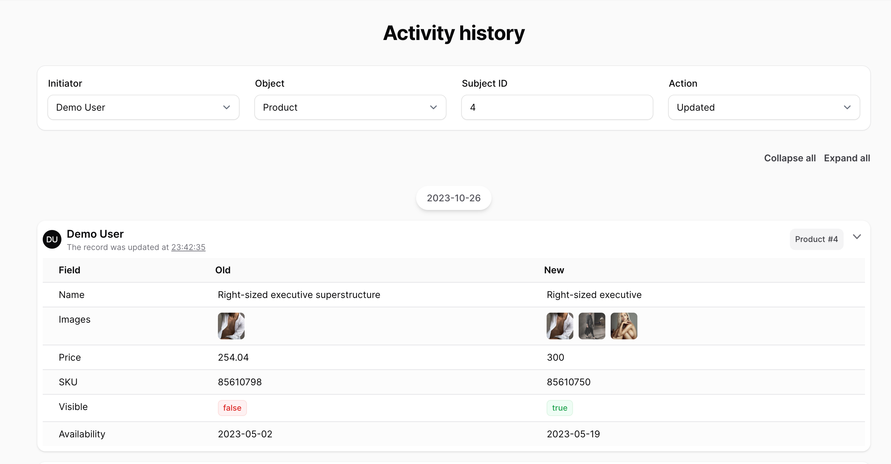

<div class="filament-hidden">


</div>

# Filament Activity Log

[](https://packagist.org/packages/noxoua/filament-activity-log)
[](LICENSE.md)

[](https://packagist.org/packages/noxoua/filament-activity-log)


This package is an add-on for simplified activity logging based on [`spatie/laravel-activitylog`](https://github.com/spatie/laravel-activitylog) package. This package also includes a page for viewing activity logs.

The viewing page was copied from [`pxlrbt/filament-activity-log`](https://github.com/pxlrbt/filament-activity-log) package and slightly modernized. If you only need the page for viewing activity logs, without additional functionality, use this package - [`pxlrbt/filament-activity-log`](https://github.com/pxlrbt/filament-activity-log)


<div class="filament-hidden">





</div>

## Installation


Install via Composer.

**Requires PHP 8.0 and Filament 3.0+**

```bash
composer require noxoua/filament-activity-log
```


You can publish the config file with:

```bash
php artisan vendor:publish --tag="filament-activity-log-config"
```

Optionally, you can publish the views using


```bash
php artisan vendor:publish --tag="filament-activity-log-views"
```


## Activities Page

### Create a page

Create a new page and extends the `ListActivities` class.

```php
<?php

namespace App\Filament\Pages;

use Noxo\FilamentActivityLog\Pages\ListActivities;

class Activities extends ListActivities
{
    //
}
```

## Logging Actions

### Create a Logger

Use the artisan command to create a logger.

```bash
php artisan make:filament-logger User
```
Result:
```bash
INFO  Filament logger [app/Filament/Loggers/UserLogger.php] created successfully.
```

### Logger - Fields

The Logger class has the fields property where you can specify all fields that need to be logged. You can also specify relations.


```php
public static ?array $fields = [
    'name',
    'email',
    'email_verified_at',
    'media', // <---- relation
    'roles', // <---- relation
];
```

### Logger - Field Types

The Logger class has the `types` property where you can specify fields and how they should be logged.

```php
public static ?array $types = [
    'email_verified_at' => 'datetime:Y-m-d', // format is optional
    'media' => 'media', // <---- spatie media-library
    'roles' => 'pluck:name', // <---- relation
];
```

Available types:
- date
- time
- datetime
- media | media:multiple
- boolean
- only:first_name,last_name
- pluck:first_name
- enum


### Logger - Field Value Views

The Logger class has the `fieldViews` property where you can define how to display specific fields in the activity log views.

```php
public static ?array $fieldViews = [
    'email_verified_at' => 'badge',
    'media' => 'avatar',
    'roles' => 'badge',
];
```

Available views:
- avatar
- image
- badge

(Note: _"avatar" and "image" have the same size but a different border-radius._)


### Logger - Field Translated Key

The Logger class has the `attributeMap` property where you can map field keys to make translations user-friendly.

```php
public static ?array $attributeMap = [
    'name' => 'first_name',
    'media' => 'avatar',
];
```

### Logger - Usage

After the logger is created, you can use it.

#### CreateRecord
```php

namespace App\Filament\Resources\UserResource\Pages;

use App\Filament\Loggers\UserLogger;

class CreateUser extends CreateRecord
{
    protected static string $resource = UserResource::class;

    public function afterCreate()
    {
        UserLogger::make($this->record)->created();
    }
}

```

#### EditRecord

```php

namespace App\Filament\Resources\UserResource\Pages;

use App\Filament\Loggers\UserLogger;


class EditUser extends EditRecord
{
    protected static string $resource = UserResource::class;

    public $before;

    public function beforeValidate()
    {
        $this->before = clone $this->record->load('roles', 'media');
    }

    public function afterSave()
    {
        $after = $this->record->load('roles', 'media');
        UserLogger::make($this->before, $after)->updated();
    }
}

```


#### Table actions

```php

->actions([
    Tables\Actions\Action::make('verify_email')
        ->action(function ($record) {

            UserLogger::make($record)
                ->through(fn ($record) => $record->markEmailAsVerified())
                ->updated();

        }),
])

```

## Contributing

Please see [CONTRIBUTING](.github/CONTRIBUTING.md) for details.

## License

The MIT License (MIT). Please see [License File](LICENSE.md) for more information.
